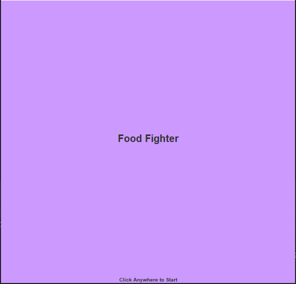
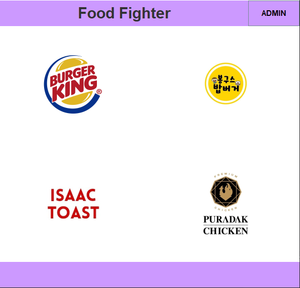
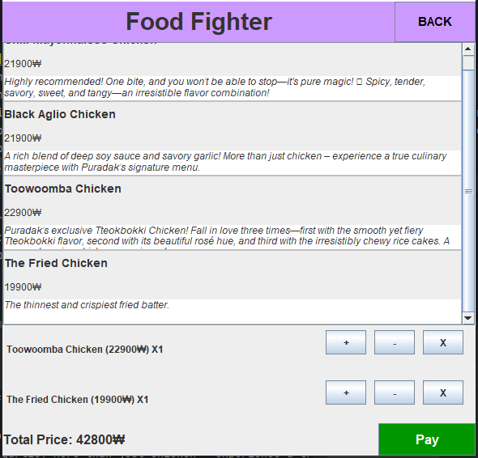
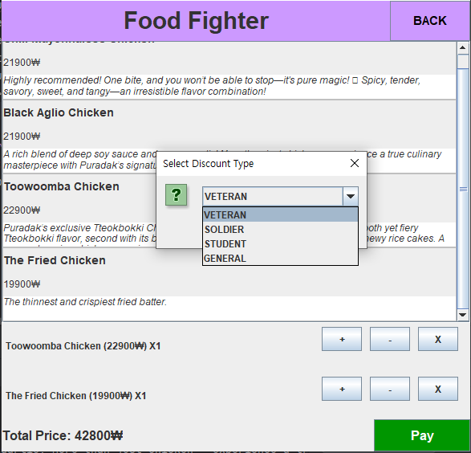
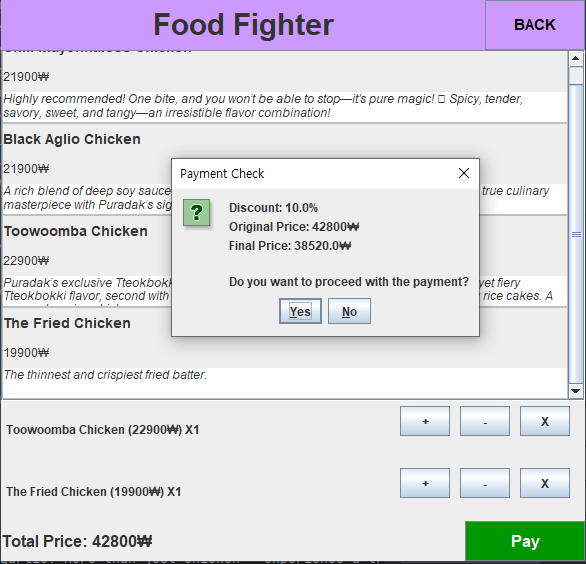
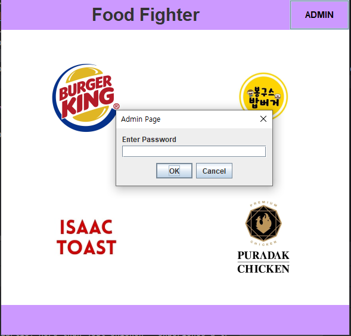
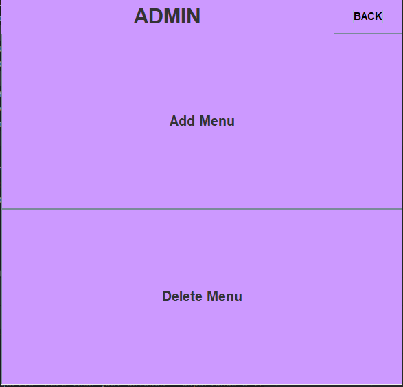
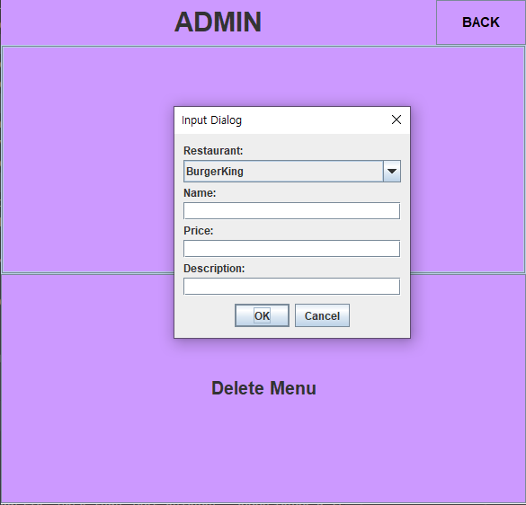
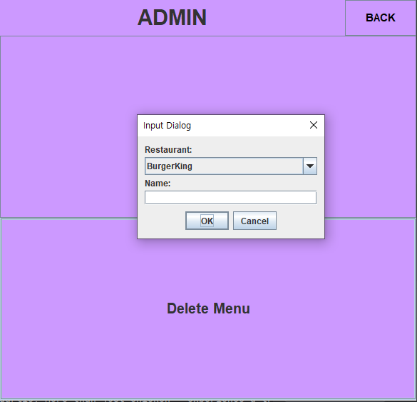

# Kiosk Application

## Project Overview
- This project began as a console-based system and has been expanded with a GUI using Java Swing.
- It manages restaurant and food data stored in a `txt` file format. The data is divided by `"&"`
   ```
    Whopper&7200&Classic taste, flame-grilled perfection – enjoy the iconic Whopper!
    Whopper Set&9100&Enjoy Whopper with drinks and fried potato!
    Monster Whopper&9300&Unleash the beast with the Monster Whopper – bigger, bolder, and packed with flavor!
    Monster Whopper Set&10800&Enjoy Monster  Whopper with drinks and fried potato!
   ```
- An admin page allows access through a password to add or remove menu items.
- Discounts are managed using `Enum`.
- An `Interface` is implemented to support future expansion to `JSON` and `XML` formats, though currently only `txt` files are functional.

## Key Features
1. **Menu Selection and Ordering**
    - Provides menu options for users to select and order items.

2. **GUI Integration (Java Swing)**
    - User-friendly interface for menu selection and payment processing.

3. **Admin Page**
    - Access through password authentication for menu management (add and delete items).

4. **Discount System (Using Enum)**
    - Applies discounts based on specific conditions.

5. **Data Management Interface**
    - Supports `txt` file format and allows future expansion to `JSON` and `XML` formats.


## Data Structure
- Stores menu and price information in a `txt` file.
- Designed for scalability with different file formats.

## How to Run
1. Run the project in a Java environment.
2. Use the console or GUI interface to place orders.
3. Access the admin page with a password to manage the menu.

## How it looks like?

- This is the start screen.
- You can start the application just by clicking anywhere.
  <br>
  <br>
  <br>


- This is the restaurant screen.
- You can check out four restaurants.
- If you click the icon of the restaurant, you can check out the menus of each restaurant.
- In the top-right corner, you can find ADMIN button. If you click the button and type the ADMIN password("0000"), you can access on ADMIN page.
  <br><br><br>

- This is the item list screen.
- You can check out foods list on the restaurant.
- If you double click the menu, the menu is added on the cart below.
- `+`: Increase the quantity by one.
- `-`: Decrease the quantity by one.
- `X`: Delete the menu from the cart.
- `Pay`: You can proceed on payment.
<br><br><br>

- If you click the `Pay` button, you can choose your discount option.
  <br><br><br>

- If you choose the discount option, you can get the payment check box and finally decide whether you will pay or not.
  <br><br><br>

- This box appears when you click the ADMIN button on the restaurant screen.
- You may type the password("0000") to access on ADMIN screen.
  <br><br><br>

- When you type the correct password, ADMIN screen comes out.
- You can add or delete menu on this page.
  <br><br><br>

- If you fill the dialogs and click the `OK` button, the menu will be added on the decided Restaurant of the combo box.
  <br><br><br>

- If you type the exact name of the menu of the restaurant, you can delete the menu.
- If you type the name which is not on the menu, you can get the message that item does not exist.

## Developer
- Developer: Kibeom Park
- Email: kibeom0806@gmail.com

